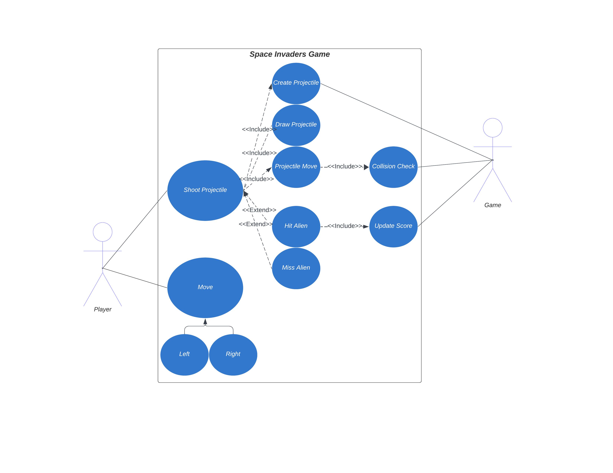
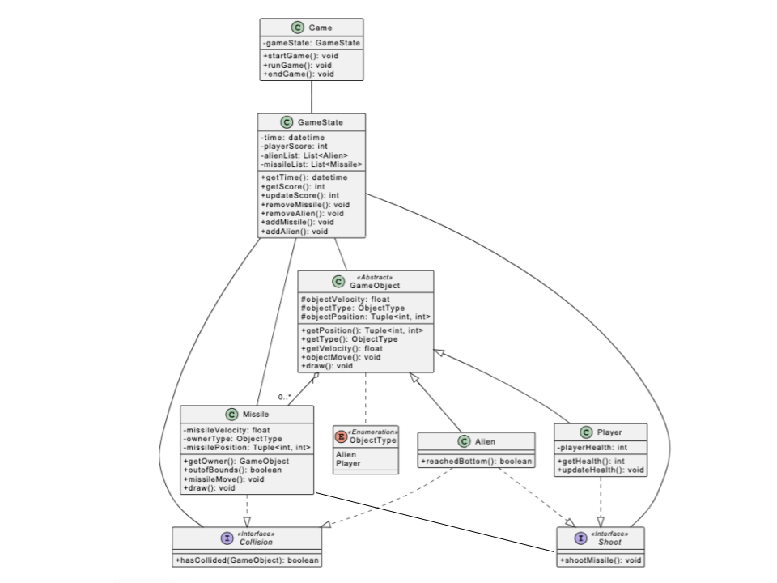

# SOFT2201 - Assignment 1 Report - UML Modelling
  
## Table of Contents
- [SOFT2201 - Assignment 1 Report - UML Modelling](#soft2201---assignment-1-report---uml-modelling)
  - [Table of Contents](#table-of-contents)
  - [Section 1: Use Case and Use Case Diagram](#section-1-use-case-and-use-case-diagram)
  - [Section 2: Sequence Diagram](#section-2-sequence-diagram)
  - [Section 3: Class Diagram](#section-3-class-diagram)

## Section 1: Use Case and Use Case Diagram 

**Use case:** Player Shoots an Alien

**Primary Actor:** Player 

**Stakeholders and Interests:**

- Player: To shoot Alien ship and score points

**Preconditions:** The Space Invaders game is running and the player is able to interact with the controls.

**Success Guarantee (Postconditions):** The player's projectile collides with the Alien ship. Both the Alien ship and projectile are removed from the screen. The player's total score is increased. 

**Main success scenario:** 
1. Player navigates it’s ship horizontally to become inline with the Alien ship’s position 
2. Player shoots projectile at Alien ship
3. Projectile is created and drawn on screen
4. Projectile moves vertically from firing position
5. Game checks for a collision between the projectile and Alien ship
6. Projectile collides with alien ship
7. Both the Projectile and Alien ship are removed and undrawn from the screen
8. Player score increases

**Extensions:**
- 6a.
    1. Projectile misses alien ship
    2. Projectile reaches the bounds of the screen and is removed and undrawn
    3. Player continues to shoot projectiles at alien ships 
    

## Section 2: Sequence Diagram 

The following is the Simple Space Invaders Game Scenario provided:

1. Game spawns aliens and puts the player in the starting position.
2. Player moves left or right
3. Player shoots a projectile
4. Projectile hits an alien
5. Alien is removed from the Game
6. Player scores a point
7. Player repeats steps 2-6 until all aliens are destroyed.
8. Game is finished

The following is the corresponding sequence diagram:

@startuml

Actor Player
Participant Game
Participant Alien
Participant Projectile

activate Player
Player -> Game: startGame()
activate Game
Game -> Player: initializePlayer()
activate Alien
Game -> Alien: spawnAliens()
group Loop [Repeat until all Aliens are removed]
    Player -> Game: playerMove()
    Player -> Projectile: shootProjectile()
    activate Projectile
    Projectile -> Alien: hasCollided()
    Alien --> Game: successfulHit()
    Game -> Projectile: removeProjectile()
    deactivate Projectile
    Game -> Alien: removeAlien()
    deactivate Alien
    Game -> Game: updateScore()
end
Game -> Player: gameCompleted()
deactivate Game
deactivate Player

@enduml

## Section 3: Class Diagram 

In the following rationale, I will break down my design into each of the corresponding components within the UML Class diagram (using abbreviations to reference design principles). I will avoid discussion on rudimentary features for brevity (setters/ getters etc.).

**Game**:
Reasoning:
The ‘Game’ Class is responsible for running the game. Using ‘startGame()’, ‘runGame()’ and ‘endGame()’ to handle each game scenario.

**GameState** Class:
‘GameState’ is responsible for tracking the important game items including Aliens, Missiles, score and time. As there will be many Aliens and Missiles at any given time ‘alienList’ and ‘missileList’ are of the ‘List’ data type. ‘updateScore()’ will be responsive to Player projectiles destroying Aliens. ‘addAlien’ will depend on ‘runGame()’ design, ‘addMissile’, ‘removeMissile’ and ‘removeAlien’ will be responsive to ‘Collision’ and ‘Shoot’.

**GameObject** Class:
‘GameObject’ is an abstract class that is the parent to both ‘Alien’ and ‘Player’. Since much of the functionality between the two classes is similar if not identical I’m employing the **DIP** and **Encapsulation** (position, velocity, move, draw etc.).

**Player** Class:
I extended the functionality of the ‘GameObject’ class for the nuances of the player such as multiple lives without interfering with the parent classes functionality hence I utilized **OCP** and **LSP**.

**Alien** Class:
I extended the functionality of the ‘GameObject’ class for the nuances of the alien such as reaching the bottom of the screen without interfering with the parent classes functionality hence I utilized **OCP** and **LSP**.

**Missile** Class:
Reasoning:
The Missile class here has an Aggregation relationship with GameObject since GameObjects (Player or Alien) contains missiles yet the Missile can exist independently.

**ObjectType** Enumeration:
Reasoning:
I created the ObjectType Enum to restrict the type a GameObject may identify as ‘Alien’, ‘Player’, and ‘Missile’.

**Shoot** Interface:
Reasoning:
I decided to make ‘Shoot’ an interface as I know both ‘Player’ and ‘Alien’ will need to shoot projectiles. Instead of adding the functionality to the GameObject, I decided to rely on the **SRP**, **ISP** (**Abstration** and **polymorphism**) and create an interface to handle new missile creation (associated with the GameObject who fired the missile).

**Collision** Interface:
Reasoning:
I decided to make ‘Collision’ an interface as I know both the Missile and Alien Classes would need to detect if an instance of each class had collided with another GameObject instance. Instead of adding the functionality to the GameObject, I decided to rely on the **SRP**, **ISP** (**Abstration** and **polymorphism**) and create an interface to handle collision between objects.
